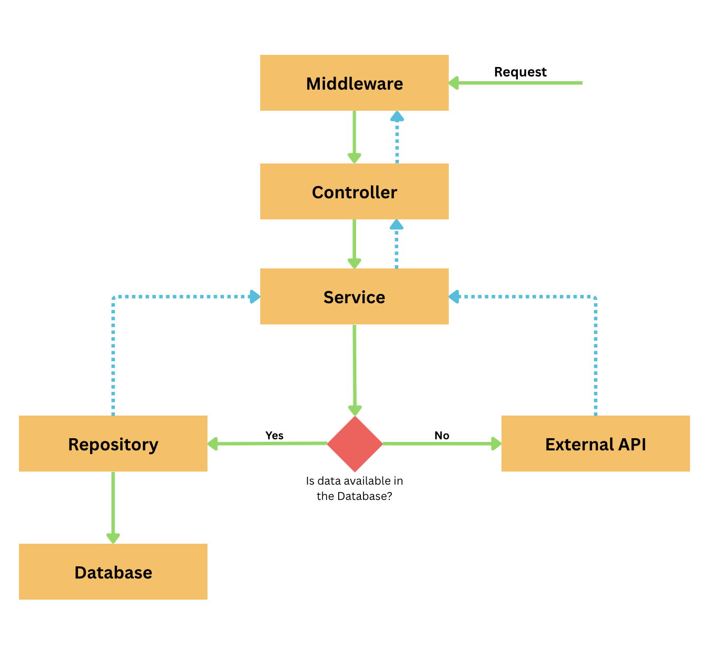

# Liquid Labs Assignment

## Project Progress:

- Project creation:
  `dotnet new webapi --use-controllers -o liquidlabs-assignment`
- Git Initialization:
  `git init`
  `dotnet new gitignore`
- Add SQL package
  `dotnet add package Microsoft.Data.SqlClient`

## Project Structure/Architecture:

- Project consists of 5 main layers
  1. Middleware
  2. Controller
  3. Service
  4. Repository
  5. Database

## Public API

- Im using RestCountries API from https://restcountries.com/
- The dataset covers 90+ normalized fields per country

## Tasks Breakdown

- Initialize the External API
-
